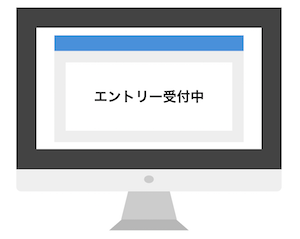

# DAY2 - Part3

## PART3 LPの開発

### Materialize

MaterializeはCSSフレームワークの1つです。マテリアルデザインのWebページを簡単に作成できるようになります。

http://materializecss.com/

> マテリアルデザイン（Material Design）は、アメリカ合衆国のGoogle社が提唱したユーザーエクスペリエンスデザインの体系、およびそれを実現する開発技術や手法、デザイン、試みなどの包括的呼称。 - Wikipedia

ここではMaterializeを使ってLPの開発にチャレンジします。

> Materialize以外にもBootstrapなど様々なCSSフレームワークがあります。  Bootstrap https://getbootstrap.com/

---

### 素材の準備

以下の2つの画像ファイルをダウンロードしておいてください

> top.jpg、entry.png は itcaret/images フォルダに配置します。

#### top.jpg


#### entry.png



#### concept.jpg


---

### index.html

Materializeを使うための雛形を準備します。ファイル名はindex.htmlとしてください。

```html
<!DOCTYPE html>
<html>
<head>
  <meta charset="utf-8">
  <title>Materialize</title>
  <meta name="robots" content="noindex">
  <meta name="viewport" content="width=device-width, initial-scale=1">
  <link rel="stylesheet" href="https://cdnjs.cloudflare.com/ajax/libs/materialize/1.0.0-rc.2/css/materialize.min.css">
  <link href="https://fonts.googleapis.com/icon?family=Material+Icons" rel="stylesheet">
  <style>
  .parallax-container {
    height: 700px;
  }
  .my-text-shadow {
    text-shadow: -1px 1px 0 rgba(255, 255, 255, 1);
    color: #333;
  }
  </style>
</head>
<body>

  <script src="https://code.jquery.com/jquery-3.3.1.min.js"></script>
  <script src="https://cdnjs.cloudflare.com/ajax/libs/materialize/1.0.0/js/materialize.min.js"></script>
  <script type="text/javascript">
  $(document).ready(function(){
    $('.parallax').parallax();
  });
  </script>
</body>
</html>
```

+ 1つ目のmetaタグは検索エンジンウェブクローラのインデックス登録対象外としています。
+ 2つ目のmetaタグはスマホで表示したときに最適なサイズを指定しています。
+ 1つ目のlinkタグは Materialize を読み込んでいます。
+ 2つ目のlinkタグは Googleの Material Icons を読み込んでいます。
  + https://design.google.com/icons/
+ bodyタグの中ではJavaScriptプログラムを読み込んでいます。

> このような設定は手書きせずにコピー＆ペーストするようにします。

---

### Step 1

ナビゲーションを作成します。既存のindex.htmlファイルにコードをコピペして追記してください。

```html
<nav class="blue">
  <div class="nav-wrapper container">
    <a href="#" class="brand-logo">Kronos Recruit Site</a>
    <ul id="nav-mobile" class="right hide-on-med-and-down">
      <li><a href="https://www.kronos.jp/">about</a></li>
    </ul>
  </div>
</nav>
```

+ 上記のコードはbodyタグの中に記述してください。
+ Materializeでは便利なclass属性が用意されているので、それらを選んで指定していきます。
+ navタグはHTML5から導入されたナビゲーションを表現するタグです。
+ navタグのclass属性に"green"としています。"blue"にしてみてください。
  + http://materializecss.com/color.html どんな色が使えるか見ておきましょう。

---


### Step 2

メインコンテンツを作成します。

```html
<div class="parallax-container">
  <div class="container row">
    <div class="col s12">
      <h2 class="my-text-shadow">We are Here for You.</h2>
      <h6 class="my-text-shadow">[ Message ]</h6>
      <h5 class="my-text-shadow">Message</h5>
    </div>
  </div>
  <div class="parallax"></div>
</div>
```

+ 1つ目のdivタグのclass属性にparallax-containerを指定しています。これによりパララックス（視覚効果）を作ることができます。
+ 2つ目のdivタグのclass属性にcontainerを指定しています。これは左右に適切な余白をとります。
+ 2つ目のdivタグのclass属性に"row"、3つ目のdivタグには"col"を指定しています。これらの組み合わせは行と列を意味します。
+ 3つ目のdivタグのcalss属性の"s12"は列幅を指定しています。sはスマホ、mはタブレット、lはデスクトップをイメージしてください。1行の合計が12になるようにします。

---

### Step 3

メッセージを記述します。

```html
<div class="white">
  <div class="container section">
    <div class="row">
      <div class="col s12 m12 l10 offset-l1">
        <h4 class="center">[ Concept ]</h4>
        <p style="font-size: 1.2rem;">
          [ クロノスはxxxなIT会社です。クロノスはxxxなIT会社です。クロノスはxxxなIT会社です。クロノスはxxxなIT会社です。クロノスはxxxなIT会社です。クロノスはxxxなIT会社です。クロノスはxxxなIT会社です。クロノスはxxxなIT会社です。クロノスはxxxなIT会社です。クロノスはxxxなIT会社です。クロノスはxxxなIT会社です。クロノスはxxxなIT会社です。 ]
        </p>
        
      </div>
    </div>
  </div>
</div>
```

+ 1つ目のdivタグのclass属性にwhiteを指定しています。これにより背景色が白色になります。
+ 2つ目のdivタグのclass属性にcontainerを指定しています。これは左右に適切な余白をとります。
+ 2つ目のdivタグのclass属性にsectionを指定しています。これは上下に適切な余白をとります。
+ "offset-l1"は1列分のオフセット（空の列）をとります。
+ "center"は中央にテキストを表示します。
+ "offset-l1"は1列分のオフセット（空の列）をとります。

---

### Step 4

3つの特徴をまとめます。

```html
<div class="yellow">
  <div class="container section">
    <div class="row">
      <div class="col s12 m4 l4">
        <div>
          <h2 class="center"><i class="material-icons" style="font-size: 4rem;" >computer</i></h2>
          <h5 class="center">[ Feature1 ]</h5>
          <p>
            [ クロノスはxxxなIT会社です。クロノスはxxxなIT会社です。クロノスはxxxなIT会社です。クロノスはxxxなIT会社です。クロノスはxxxなIT会社です。クロノスはxxxなIT会社です。]
          </p>
        </div>
      </div>
      <div class="col s12 m4 l4">
        <div class="icon-block">
          <h2 class="center"><i class="material-icons" style="font-size: 4rem;">gavel</i></h2>
          <h5 class="center">[ Feature2 ]</h5>
          <p>
            [ クロノスはxxxなIT会社です。クロノスはxxxなIT会社です。クロノスはxxxなIT会社です。クロノスはxxxなIT会社です。クロノスはxxxなIT会社です。クロノスはxxxなIT会社です。]
          </p>
        </div>
      </div>
      <div class="col s12 m4 l4">
        <div class="icon-block">
          <h2 class="center"><i class="material-icons" style="font-size: 4rem;">group_add</i></h2>
          <h5 class="center">[ Feature3 ]</h5>
          <p>
            [ クロノスはxxxなIT会社です。クロノスはxxxなIT会社です。クロノスはxxxなIT会社です。クロノスはxxxなIT会社です。クロノスはxxxなIT会社です。クロノスはxxxなIT会社です。]
          </p>
        </div>
      </div>
    </div>
  </div>
</div>
```

+ &lt;i class="material-icons" style="font-size: 4rem;" &gt;computer&lt;/i&gt; はGoogleのマテリアルアイコンを取得しています。
  + https://design.google.com/icons/ からお好みのアイコンを探してみましょう。

---

### Step 5

募集要項を作ります。

```html
<div class="white">
  <div class="container section">
    <div class="row">
      <div class="col s12 m12 l10 offset-l1">
        <h2 class="center"><i class="material-icons" style="font-size: 4rem;">group</i></h2>
        <h4 class="center">募集要項</h4>
        <p style="font-size: 1.2rem;">
          当社の募集職種は文系・理系、プログラミングの経験は一切問いません。<br>
          プログラミングの経験が必要ない理由は、IT教育事業のノウハウを活かした研修制度が充実しています。
        </p>
        <table style="font-size: 0.9rem;">
          <tr>
            <td rowspan="1">募集職種</td>
            <td>ITエンジニア</td>
          </tr>
          <tr>
            <td rowspan="1">業務内容</td>
            <td>当社が運営するサービスの開発、又は請負や常駐でのシステム開発を担当していただきます。<br>
              当社サービスの開発に参画頂く場合は、企画から開発～運用まで幅広く携わることができ、<br>
              自由な発想で新しい技術を活用して存分に力を発揮頂けます。</td>
          </tr>
          <tr>
            <td rowspan="2">勤務時間</td>
            <td>東京本社：10:00～19:00（プロジェクトにより異なることがあります）</td>
          </tr>
          <tr>
            <td>大阪本社：9:00～18:00（プロジェクトにより異なることがあります）</td>
          </tr>
          <tr>
            <td rowspan="1">休日休暇</td>
            <td>土日、祝日、夏期休暇、年末年始休暇、有給休暇、慶弔休暇、特別休暇　など</td>
          </tr>
          <tr>
            <td rowspan="2">福利厚生</td>
            <td>各種社会保険完備、定期健康診断、厚生年金、執筆報酬、関東ITソフトウェア健康保険</td>
          </tr>
          <tr>
            <td>組合加盟による特典（保養施設、旅行パック、スポーツクラブ、スポーツ施設など）</td>
          </tr>
          <tr>
            <td rowspan="1">賞与</td>
            <td>年2回（6月、12月）</td>
          </tr>
          <tr>
            <td rowspan="1">交通費</td>
            <td>全額実費支給</td>
          </tr>
          <tr>
            <td rowspan="1">諸手当</td>
            <td>役割手当、技術手当、住宅手当、家族手当、資格手当　など</td>
          </tr>
        </table>
      </div>
    </div>
  </div>
</div>
```

---

### Step 6

申し込みフォームを作ります。

```html

<div class="white">
  <div class="container section">
    <div class="row">
      <div class="col s12 m6 l6 center">
        <div class="section">
          
        </div>
      </div>
      <div class="col s12 m6 l6 center">
        <p class="left-align">
          ご応募はコチラから！
        </p>
        <form action="#" method="post">
          <input placeholder="お名前" type="text" >
          <input placeholder="大学名" type="text" >
          <input placeholder="メールアドレス" type="text" >
          <input type="button" value="Entry" class="btn" onclick="alert('thank you.')">
        </form>
      </div>
    </div>
  </div>
</div>
```

+ "green lighten-5"と指定すると緑が薄くなります。lighten-1からlighten-5まで選べます。
+ HTMLのform、inputタグは入力フォームを作るために使います。
+ 登録するボタンを押すとアラートが表示されます。JavaScriptを使っています。
  + 実際にメールアドレスを実際に登録するにはどうすればいいのでしょうか。。

---

### Step 7

フッターを作ります。

```html
<footer class="blue white-text center">
<div class="section">
  <iframe src="https://www.google.com/maps/embed?pb=!1m18!1m12!1m3!1d3280.9773391559943!2d135.49990471475877!3d34.68052139180737!2m3!1f0!2f0!3f0!3m2!1i1024!2i768!4f13.1!3m3!1m2!1s0x6000e4304fd9f8a3%3A0x67454996deecd242!2z77yI5qCq77yJ44Kv44Ot44OO44K5!5e0!3m2!1sja!2sjp!4v1538474443208" width="800" height="600" frameborder="0" style="border:0" allowfullscreen></iframe>
  <div>
    <h5>お問い合わせ先</h5>
    <ul>
      <li>株式会社クロノス</li>
      <li><a href="http://kronos-jp.net/" target="_blank" class="white-text">http://www.kronos-jp.net/</a></li>
    </ul>
  </div>
  <div class="footer-copyright">
    Kronos Co., Ltd.© Copyright 2017
  </div>
</div>
</footer>
```
+ &lt;iframe&gt;タグを使ってGoogle Mapを読み込んでいます。Youtube動画なども同様に読み込むことができます。

---

### ここまでの完成版

```html
<!DOCTYPE html>
<html>
<head>
  <meta charset="utf-8">
  <title>Materialize</title>
  <meta name="robots" content="noindex">
  <meta name="viewport" content="width=device-width, initial-scale=1">
  <link rel="stylesheet" href="https://cdnjs.cloudflare.com/ajax/libs/materialize/1.0.0-rc.2/css/materialize.min.css">
  <link href="https://fonts.googleapis.com/icon?family=Material+Icons" rel="stylesheet">
  <style>
  .parallax-container {
    height: 700px;
  }
  .my-text-shadow {
    text-shadow: -1px 1px 0 rgba(255, 255, 255, 1);
    color: #333;
  }
  </style>
</head>
<body>
  <nav class="blue">
    <div class="nav-wrapper container">
      <a href="#" class="brand-logo">Kronos Recruit Site</a>
      <ul id="nav-mobile" class="right hide-on-med-and-down">
        <li><a href="https://www.kronos.jp/">about</a></li>
      </ul>
    </div>
  </nav>

  <div class="parallax-container">
    <div class="container row">
      <div class="col s12">
        <h2 class="my-text-shadow">We are Here for You.</h2>
        <h6 class="my-text-shadow">[ Message ]</h6>
        <h5 class="my-text-shadow">Message</h5>
      </div>
    </div>
    <div class="parallax"></div>
  </div>

  <div class="white">
    <div class="container section">
      <div class="row">
        <div class="col s12 m12 l10 offset-l1">
          <h4 class="center">[ Concept ]</h4>
          <p style="font-size: 1.2rem;">
            [ クロノスはxxxなIT会社です。クロノスはxxxなIT会社です。クロノスはxxxなIT会社です。クロノスはxxxなIT会社です。クロノスはxxxなIT会社です。クロノスはxxxなIT会社です。クロノスはxxxなIT会社です。クロノスはxxxなIT会社です。クロノスはxxxなIT会社です。クロノスはxxxなIT会社です。クロノスはxxxなIT会社です。クロノスはxxxなIT会社です。 ]
          </p>
          
        </div>
      </div>
    </div>
  </div>

  <div class="yellow">
    <div class="container section">
      <div class="row">
        <div class="col s12 m4 l4">
          <div>
            <h2 class="center"><i class="material-icons" style="font-size: 4rem;" >computer</i></h2>
            <h5 class="center">[ Feature1 ]</h5>
            <p>
              [ クロノスはxxxなIT会社です。クロノスはxxxなIT会社です。クロノスはxxxなIT会社です。クロノスはxxxなIT会社です。クロノスはxxxなIT会社です。クロノスはxxxなIT会社です。]
            </p>
          </div>
        </div>
        <div class="col s12 m4 l4">
          <div class="icon-block">
            <h2 class="center"><i class="material-icons" style="font-size: 4rem;">gavel</i></h2>
            <h5 class="center">[ Feature2 ]</h5>
            <p>
              [ クロノスはxxxなIT会社です。クロノスはxxxなIT会社です。クロノスはxxxなIT会社です。クロノスはxxxなIT会社です。クロノスはxxxなIT会社です。クロノスはxxxなIT会社です。]
            </p>
          </div>
        </div>
        <div class="col s12 m4 l4">
          <div class="icon-block">
            <h2 class="center"><i class="material-icons" style="font-size: 4rem;">group_add</i></h2>
            <h5 class="center">[ Feature3 ]</h5>
            <p>
              [ クロノスはxxxなIT会社です。クロノスはxxxなIT会社です。クロノスはxxxなIT会社です。クロノスはxxxなIT会社です。クロノスはxxxなIT会社です。クロノスはxxxなIT会社です。]
            </p>
          </div>
        </div>
      </div>
    </div>
  </div>

  <div class="white">
    <div class="container section">
      <div class="row">
        <div class="col s12 m12 l10 offset-l1">
          <h2 class="center"><i class="material-icons" style="font-size: 4rem;">group</i></h2>
          <h4 class="center">募集要項</h4>
          <p style="font-size: 1.2rem;">
            当社の募集職種は文系・理系、プログラミングの経験は一切問いません。<br>
            プログラミングの経験が必要ない理由は、IT教育事業のノウハウを活かした研修制度が充実しています。
          </p>
          <table style="font-size: 0.9rem;">
            <tr>
              <td rowspan="1">募集職種</td>
              <td>ITエンジニア</td>
            </tr>
            <tr>
              <td rowspan="1">業務内容</td>
              <td>当社が運営するサービスの開発、又は請負や常駐でのシステム開発を担当していただきます。<br>
                当社サービスの開発に参画頂く場合は、企画から開発～運用まで幅広く携わることができ、<br>
                自由な発想で新しい技術を活用して存分に力を発揮頂けます。</td>
              </tr>
              <tr>
                <td rowspan="2">勤務時間</td>
                <td>東京本社：10:00～19:00（プロジェクトにより異なることがあります）</td>
              </tr>
              <tr>
                <td>大阪本社：9:00～18:00（プロジェクトにより異なることがあります）</td>
              </tr>
              <tr>
                <td rowspan="1">休日休暇</td>
                <td>土日、祝日、夏期休暇、年末年始休暇、有給休暇、慶弔休暇、特別休暇　など</td>
              </tr>
              <tr>
                <td rowspan="2">福利厚生</td>
                <td>各種社会保険完備、定期健康診断、厚生年金、執筆報酬、関東ITソフトウェア健康保険</td>
              </tr>
              <tr>
                <td>組合加盟による特典（保養施設、旅行パック、スポーツクラブ、スポーツ施設など）</td>
              </tr>
              <tr>
                <td rowspan="1">賞与</td>
                <td>年2回（6月、12月）</td>
              </tr>
              <tr>
                <td rowspan="1">交通費</td>
                <td>全額実費支給</td>
              </tr>
              <tr>
                <td rowspan="1">諸手当</td>
                <td>役割手当、技術手当、住宅手当、家族手当、資格手当　など</td>
              </tr>
            </table>
          </div>
        </div>
      </div>
    </div>

    <div class="white">
      <div class="container section">
        <div class="row">
          <div class="col s12 m6 l6 center">
            <div class="section">
              
            </div>
          </div>
          <div class="col s12 m6 l6 center">
            <p class="left-align">
              ご応募はコチラから！
            </p>
            <form action="#" method="post">
              <input placeholder="お名前" type="text" >
              <input placeholder="大学名" type="text" >
              <input placeholder="メールアドレス" type="text" >
              <input type="button" value="Entry" class="btn" onclick="alert('thank you.')">
            </form>
          </div>
        </div>
      </div>
    </div>

    <footer class="blue white-text center">
      <div class="section">
        <iframe src="https://www.google.com/maps/embed?pb=!1m18!1m12!1m3!1d3280.9773391559943!2d135.49990471475877!3d34.68052139180737!2m3!1f0!2f0!3f0!3m2!1i1024!2i768!4f13.1!3m3!1m2!1s0x6000e4304fd9f8a3%3A0x67454996deecd242!2z77yI5qCq77yJ44Kv44Ot44OO44K5!5e0!3m2!1sja!2sjp!4v1538474443208" width="800" height="600" frameborder="0" style="border:0" allowfullscreen></iframe>
        <div>
          <h5>お問い合わせ先</h5>
          <ul>
            <li>株式会社クロノス</li>
            <li><a href="http://kronos-jp.net/" target="_blank" class="white-text">http://www.kronos-jp.net/</a></li>
          </ul>
        </div>
        <div class="footer-copyright">
          Kronos Co., Ltd.© Copyright 2017
        </div>
      </div>
    </footer>

    <script src="https://code.jquery.com/jquery-3.3.1.min.js"></script>
    <script src="https://cdnjs.cloudflare.com/ajax/libs/materialize/1.0.0/js/materialize.min.js"></script>
    <script type="text/javascript">
    $(document).ready(function(){
      $('.parallax').parallax();
    });
  </script>
</body>
</html>
```

---

### 課題

以下のとおり変更してみましょう。

+ ナビゲーションバーのカラーを変更してみましょう。
  + 参考： https://materializecss.com/color.html
+ サンプルのFeature1、Feature2、Feature3のマテリアルアイコンを変更してみましょう。
  + 参考： https://materializecss.com/icons.html
+ 2カラム（列）のセクションを作成してみましょう。
  + 参考： https://materializecss.com/grid.html
